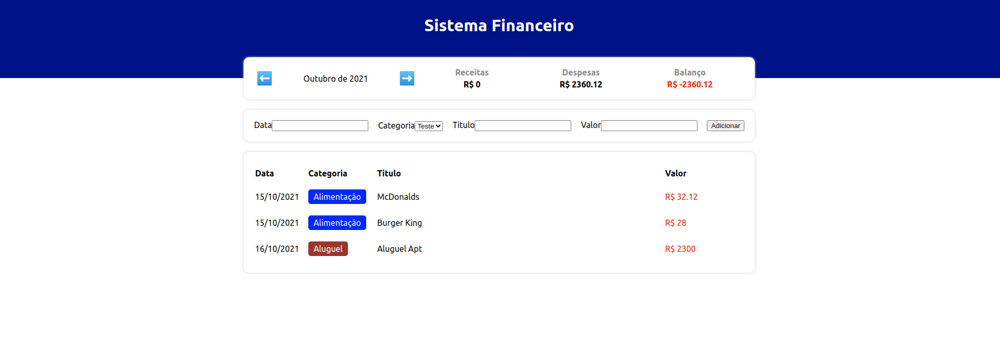

> # Projeto 1 - Lista de Tarefas

- Projeto que consiste em ser uma simples to-do list de tarefas
- É possível criar uma tarefa, finalizar uma tarefa e listar todas elas
- Uso do `styled-components` para aplicar estilos nos componentes



&nbsp;

> ## <a name="dependencias"></a> Dependências
- [@types/styled-components](https://www.npmjs.com/package/@types/styled-components) - Pacote de tipagens para o styled-components
- [styled-components](https://styled-components.com) - Lib para React e React Native que permite estilizar componentes na aplicação
- [typescript](https://www.typescriptlang.org) - Superset de JavaScript que permite a utilização de tipagens e outros recursos

&nbsp;

> ## Run App
Navegar pela linha comando até a pasta do projeto `expense-tracker`
```
cd expense-tracker
```

Instalar o `node_modules` com as [Dependências](#dependencias)
```
npm install
```

Rodar o projeto
```
npm start
```