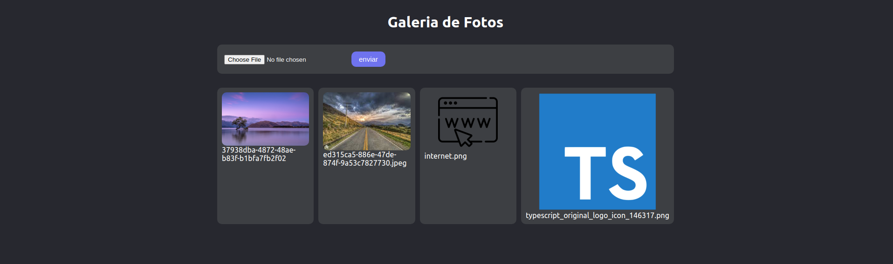

# Projeto 3 - Galeria de fotos

- Projeto de galeria de imagens
- Nele é possível adicionar e exibir imagens
- Projeto integrado com o `firebase`
- O firebase foi utilizado para armazenar as imagens (Storage)
- Utilização do `.env`
- Uso do `styled-components` para aplicar estilos nos componentes



&nbsp;

> ## <a name="dependencias"></a> Dependências

- [@types/styled-components](https://www.npmjs.com/package/@types/styled-components) - Pacote de tipagens para o styled-components
- [@types/uuid](https://www.npmjs.com/package/@types/uuid) - Pacote de tipagens da lib uuid
- [firebase](https://firebase.google.com/?hl=pt) - Plataforma de desenvolvimento de aplicativos móveis da google
- [styled-components](https://styled-components.com) - Lib para React e React Native que permite estilizar componentes na aplicação
- [typescript](https://www.typescriptlang.org) - Superset de JavaScript que permite a utilização de tipagens e outros recursos
- [uuid](https://www.npmjs.com/package/uuid) - Lib que gera hashs aleatórios

&nbsp;

> ## Pré configurações do Firebase

- Para funcionar corretamente, é necessário preencher as variáveis de ambiente que pertencem ao firebase
- O arquivo modelo se encontra na raiz do projeto com o nome de `.env.exemple`
- É necessário criar um arquivo chamado `.env.local`, copiar as chaves do arquivo modelo e preencher as mesmas com os dados correspondentes a cada chave
- Dentro do storage do Firebase é necessário criar uma pasta chamada **images**, onde ficarão armazenadas as imagens, assim sendo essa pasta a principal referência de onde será guardada as imagens

&nbsp;

> ## Run App

Navegar pela linha comando até a pasta do projeto `gallery`
```
cd gallery
```

Instalar o `node_modules` com as [Dependências](#dependencias)
```
npm install
```

Rodar o projeto
```
npm start
```