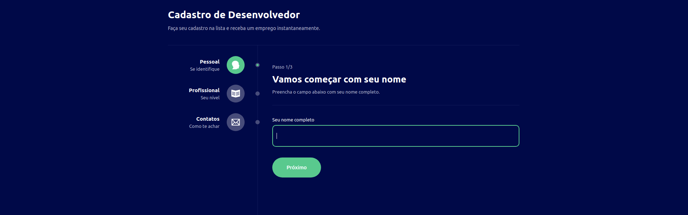

# Projeto 5 - Formulário multi-etapas

- Projeto que contém um cadastro de multiplas etapas
- Nele é possível se cadastrar e fazer um resumo de todos os dados preenchidos
- Validação de campos não preenchidos
- Utilização de contextos para gerenciar o estado da aplicação
- Uso do `styled-components` para aplicar estilos nos componentes
- Uso de `react-router-dom` para as rotas
- Uso de `contextApi` para contextos
- Uso dos hooks `useHistory` e `useEffect`
- Uso de SVGs



&nbsp;

> ## <a name="dependencias"></a> Dependências

- [@types/react-router-dom](https://www.npmjs.com/package/@types/react-router-dom) - Pacote de tipagens para o react-router-dom
- [@types/styled-components](https://www.npmjs.com/package/@types/styled-components) - Pacote de tipagens para o styled-components
- [react-router-dom](https://reactrouter.com/web/guides/quick-start) - Lib para criação de rotas na aplicação
- [styled-components](https://styled-components.com) - Lib para React e React Native que permite estilizar componentes na aplicação
- [typescript](https://www.typescriptlang.org) - Superset de JavaScript que permite a utilização de tipagens e outros recursos

&nbsp;

> ## Run App

Navegar pela linha comando até a pasta do projeto `multiform`
```
cd multiform
```

Instalar o `node_modules` com as [Dependências](#dependencias)
```
npm install
```

Rodar o projeto
```
npm start
```