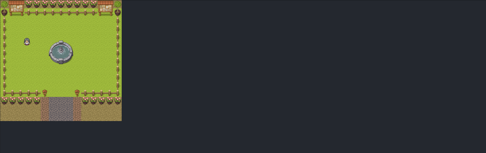

# Projeto 4 - Jogo RPG

- Jogo RPG feito em React.Js
- Nele é possível andar para as 4 direções utilizando as teclas A, S, D, W e as setas
- Há obstáculos onde o personagem não pode ultrapassar 
- Uso do `styled-components` para aplicar estilos nos componentes
- Criação de `hooks customizados`



&nbsp;

> ## <a name="dependencias"></a> Dependências

- [@types/styled-components](https://www.npmjs.com/package/@types/styled-components) - Pacote de tipagens para o styled-components
- [styled-components](https://styled-components.com) - Lib para React e React Native que permite estilizar componentes na aplicação
- [typescript](https://www.typescriptlang.org) - Superset de JavaScript que permite a utilização de tipagens e outros recursos

&nbsp;

> ## Run App

Navegar pela linha comando até a pasta do projeto `rpg`
```
cd rpg
```

Instalar o `node_modules` com as [Dependências](#dependencias)
```
npm install
```

Rodar o projeto
```
npm start
```